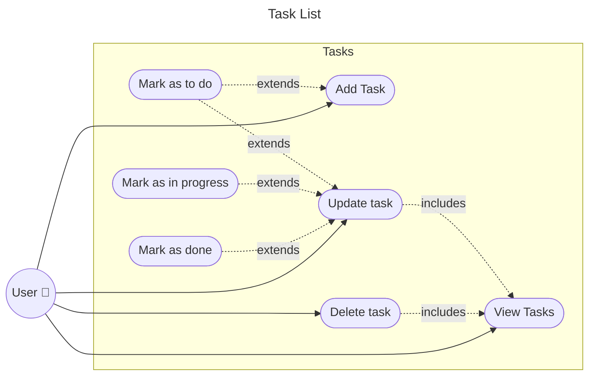

# Habita design document

## Diagrams

```mermaid
---
title: Task List
---
flowchart LR;
  subgraph Tasks;
    view([View Tasks]);
    add([Add Task]);
    update([Update task]);
    delete([Delete task]);
    markToDo([Mark as to do]);
    markInProgress([Mark as in progress]);
    markDone([Mark as done]);

    markToDo -. extends .-> update;
    markInProgress -. extends .-> update;
    markDone -. extends .-> update;

    update -. includes .-> view;
    markToDo -. extends .-> add;
    delete -. includes .-> view;
  end;

  user((User 👤));

  user --> view;
  user --> add;
  user ---> update;
  user --> delete;
```
